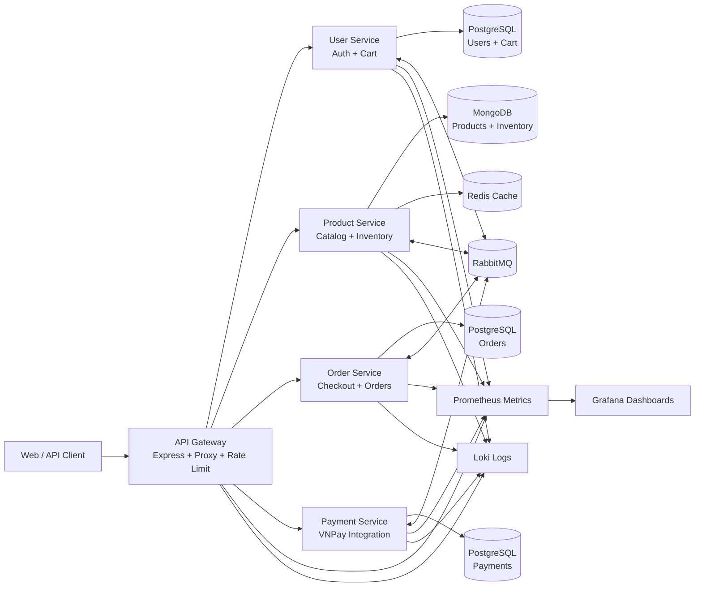

# Shoe E-Commerce Microservices


Shoe E-Commerce Microservices is a portfolio backend project that demonstrates a Dockerized e-commerce platform built with a microservices architecture. It focuses on real-world backend concerns such as API Gateway routing, authentication, checkout reliability, asynchronous messaging, payment integration, observability, and standardized error handling.

> This is a learning and portfolio project, not a production deployment template. The codebase is designed to showcase backend architecture decisions and engineering trade-offs.

## Architecture



## Tech Stack

| Area | Technologies |
| --- | --- |
| Backend | Node.js, Express.js, REST APIs |
| API Gateway | Express, http-proxy-middleware, rate limiting, Helmet, CORS |
| Authentication | JWT, bcrypt, role/admin middleware, internal service token |
| Databases | PostgreSQL, MongoDB replica set |
| Cache | Redis |
| Message Broker | RabbitMQ |
| Payment | VNPay sandbox integration |
| Observability | Prometheus, Grafana, Loki, Promtail, structured logs |
| DevOps | Docker, Docker Compose, GitHub Actions smoke test |
| Testing | Jest, Supertest, Dockerized smoke test |

## Key Features

- **Microservices architecture** with separate services for users, products, orders, payments, and gateway routing.
- **JWT authentication and authorization** for protected user, cart, checkout, and admin flows.
- **VNPay payment integration** with payment transaction persistence and callback handling.
- **Idempotent checkout flow** to reduce duplicate order creation during retries or network failures.
- **RabbitMQ messaging** for asynchronous service communication and domain events.
- **Standardized error contract** with request IDs, error codes, details, and timestamps across services.
- **Health checks and Docker orchestration** for all services and infrastructure dependencies.
- **Observability baseline** with metrics, logs, Prometheus, Grafana, Loki, and Promtail.
- **CI smoke testing** through GitHub Actions using Docker Compose and an end-to-end checkout scenario.

## Services

| Service | Default Port | Responsibility |
| --- | ---: | --- |
| API Gateway | `8000` | Public entrypoint, routing, security middleware, health aggregation |
| User Service | `3001` | Registration, login, profile, password changes, cart management |
| Product Service | `3002` | Product catalog, variants, inventory, admin product operations |
| Order Service | `3003` | Checkout, order creation, order history, idempotency handling |
| Payment Service | `3004` | VNPay payment URL creation, return/IPN handling, payment records |

## Quick Start

### Prerequisites

- Docker and Docker Compose
- Git

### 1. Clone the repository

```bash
git clone <your-repository-url>
cd shoe-ecommerce-microservices
```

### 2. Create environment files

Copy the example files and replace placeholder values as needed:

```bash
cp .env.example .env
cp user-service/.env.example user-service/.env
cp order-service/.env.example order-service/.env
cp product-service/.env.example product-service/.env
cp payment-service/.env.example payment-service/.env
```

On Windows PowerShell:

```powershell
Copy-Item .env.example .env
Copy-Item user-service/.env.example user-service/.env
Copy-Item order-service/.env.example order-service/.env
Copy-Item product-service/.env.example product-service/.env
Copy-Item payment-service/.env.example payment-service/.env
```

### 3. Start the platform

```bash
docker compose up -d --build
```

### 4. Check service health

```bash
curl http://localhost:8000/health
```

### 5. Run the smoke test

```bash
docker compose --profile test run --rm smoke-test
```

### 6. Stop the platform

```bash
docker compose down -v
```

## Useful URLs

| Tool | URL |
| --- | --- |
| API Gateway Health | http://localhost:8000/health |
| Prometheus | http://localhost:9090 |
| Grafana | http://localhost:3005 |
| Loki | http://localhost:3100 |
| RabbitMQ Management | Exposed inside Docker network unless mapped manually |

## Standardized Error Response

All HTTP-facing services use a common error response shape:

```json
{
  "success": false,
  "error": {
    "code": "VALIDATION_ERROR",
    "message": "Invalid request payload",
    "requestId": "req_123",
    "details": [],
    "timestamp": "2026-05-11T16:00:00.000Z"
  }
}
```

This makes API failures easier to trace across gateway logs, service logs, and client responses.

## CI

The GitHub Actions workflow in `.github/workflows/smoke-test.yml` validates the Docker Compose configuration, starts the platform, waits for gateway health, and runs a Dockerized smoke test.

## Security Notes

- Real `.env` files are intentionally ignored by Git.
- Only `.env.example` files should be committed.
- Rotate any local secrets before making the repository public if they were ever committed in the past.
- VNPay credentials in local development should use sandbox values only.

## Project Status

This project is ready to present as a backend microservices portfolio project. The next improvements would be broader unit/integration test coverage, OpenTelemetry distributed tracing, API versioning, and a transactional outbox/inbox pattern for stronger event reliability.